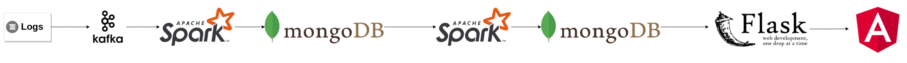
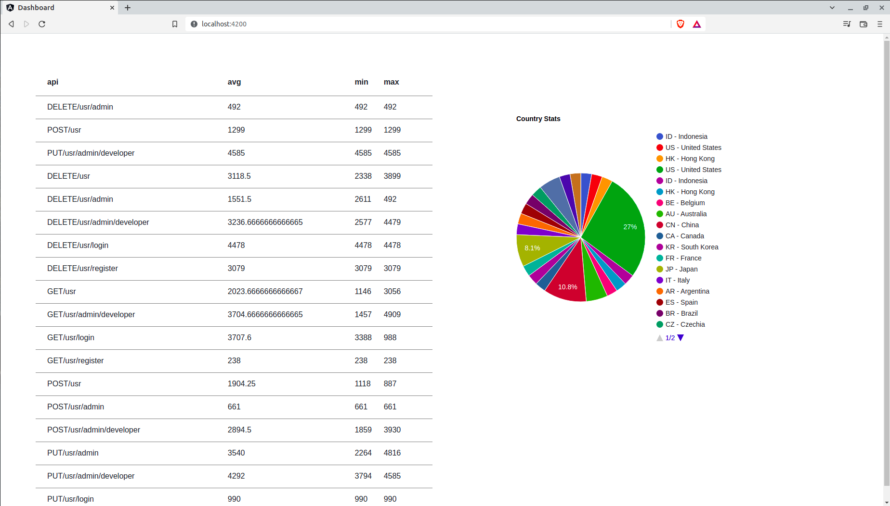

# Data Pipeline

This project consists of implementing a data pipeline. The goal of our pipeline is to bring insights from the logs of deployed microservices.
Since we didn't really implement, nor deployed microservices, we will simulate these logs using the following [Kaggle dataset](https://www.kaggle.com/datasets/vishnu0399/server-logs?select=logfiles.log). 

## Architecture

  

The process is simple, each log line will be sent to a __Kafka topic__. We'll have a __Spark Streaming__ process that takes each line of log from Kafka and cleans it - taking the IP address and extracting the country from it, trimming edges of strings, droping useless information, etc. The cleaned data then will be stored to __MongoDB__. There's a __Spark Batch__ process that will get all of the data from MongoDB and generate stats - the possibilities are endless. In our case, we extracted two stats; one related to APIs' response time and the other related to the distribution of countries when it comes to sending requests. These informations are stored in __MongoDB__ to be consumed by a __Flask__ API when the __Angular dashboad__ fetches the data.

## How to run the project

First, you will need to run the containers, so start by running the following

`docker-compose up`

While waiting forever for the containers to run - yes, it does take time sadly - let's install the libraries you'll need in order to run the python scripts.

`python3 -m pip install requirements.txt`

I use Linux, but I believe if you're a Windows user, you should probably either use `py -m pip install requirements.txt` or simply `pip install requirements.txt`.

Now moving forward, if your containers are ready, what you'll need to do next is download the [Kaggle dataset](https://www.kaggle.com/datasets/vishnu0399/server-logs?select=logfiles.log) and put it in the root of the project.

Now, we have our containers running, we have our libraries installed, we have our dataset - next thing you'll need to do is run the producer that will send to Kafka the logs line by line.

`python3 producer.py`

Now, while that process is running, run the Spark Streaming process.

`python3 preprocessing.py`

And now, Spark is treating the logs line by line and is saving the processed data in Mongo.

To run the Spark Batch process;

`python3 processing.py`

Now we have our stats in Mongo, let's run the flask app! Let's run the following;

`cd api`

`export FLASK_APP=api`

`flask run`

And your flask app is running! Next thing is to run the Angular dashboard. Open an another terminal and;

`cd dashboard`

`npm install`

`npm start`

You should be met with the following interface;

  

__Now I know that it's not the best UI in the world, but it's honest work...__

### And that's all folks, I hope you enjoyed the project!